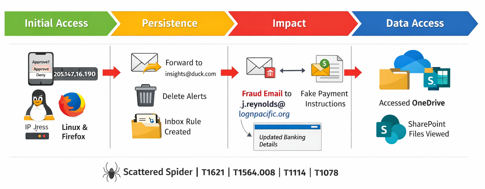

# 🛡️ BEC Investigation – MFA Fatigue Attack (Scattered Spider)

---

## 🚨 Overview

This project documents a full-scale Security Operations Center (SOC) investigation into a Business Email Compromise (BEC) attack.

The attacker leveraged:

- MFA fatigue (push bombing)
- Inbox rule persistence
- Internal email spoofing (thread hijacking)
- Cloud data access (OneDrive / SharePoint)

The investigation was conducted using:

- Microsoft Sentinel (KQL)
- SigninLogs, CloudAppEvents, EmailEvents
- MITRE ATT&CK framework for threat mapping

---

## 🎯 Key Outcomes
- Identified MFA fatigue attack leading to account compromise
- Correlated attacker activity across identity, email, and cloud telemetry
- Detected malicious inbox rules used for persistence and evasion
- Confirmed fraudulent internal email targeting finance operations
- Identified post-compromise data access in Microsoft OneDrive

---

## Indicators of Compromise

| IOC Type | Value | Context |
|---|---|---|
| IP Address | `205.147.16.190` | Attacker source IP (Netherlands) |
| Email Address | `insights@duck.com` | Inbox rule forwarding destination |
| Email Address | `jwilson.vhr@proton.me` | *(not observed in this hunt, included from threat intel on Scattered Spider)* |
| Session ID | `00225cfa-a0ff-fb46-a079-5d152fcdf72a` | Attacker session GUID across all activity |
| User Agent | `Firefox 147.0 / Linux` | Attacker browser and OS |
| Email Subject | `RE: Invoice #INV-2026-0892 - Updated Banking Details` | BEC email subject line |
| Inbox Rule | `.` (single dot) | Forward rule name |
| Inbox Rule | `..` (double dot) | Delete rule name |

---
  
## Attack Flow (Kill Chain)

  

### Figure 1 – BEC Attack Kill Chain

---

## Attack Timeline

| Time (UTC) | Event |
|---|---|
| 21:54:24 | First MFA fatigue attempt (ResultType 50074) |
| 21:54:55 | Second MFA denial (ResultType 50140) |
| 21:55:15 | Third MFA denial (ResultType 50140) |
| 21:59:52 | MFA approved, attacker signs in to One Outlook Web |
| ~22:00 | MailItemsAccessed, attacker reads Mark's emails |
| 22:02 | Forward rule (`.`) created, sends invoice emails to insights@duck.com |
| 22:03 | Delete rule (`..`) created, auto-deletes security alerts |
| ~22:09 | Attacker accesses SharePoint and OneDrive files |
| ~22:24 | BEC email sent to j.reynolds with fraudulent invoice |

---

## 🔎 Detection & Analysis

### Key Artifacts

- **KQL Queries & Detection Engineering**
  - [`queries.md`](./queries/queries.md)  
    KQL queries used during the investigation to identify attacker behavior, later refined into production detection rules.

  - [`sentinel-analytics.md`](./detection-rules/sentinel-analytics.md)  
    Primary detection rules developed for Microsoft Sentinel analytics.

### ⚙️ Automation / SOAR

- [`playbooks.md`](./automation/playbooks.md)  
  SOAR playbooks designed to automate security operations and enable faster, more consistent incident response.

---

## Solution Summary

| # | Question | Answer |
|---|----------|------|
| Q00 | Workspace name | `law-cyber-range` |
| Q01 | Compromised account | `m.smith@lognpacific.org` |
| Q02 | Attacker source IP | `205.147.16.190` |
| Q03 | Attack origin country | `NL` |
| Q04 | MFA denial error code | `50074` |
| Q05 | MFA fatigue intensity | `3` |
| Q06 | Application accessed | `One Outlook Web` |
| Q07 | Attacker OS | `Linux` |
| Q08 | Attacker browser | `Firefox 147.0` |
| Q09 | First post-auth action | `MailItemsAccessed` |
| Q10 | Rule creation method | `New-InboxRule` |
| Q11 | Forward rule name | `.` |
| Q12 | Forward destination | `insights@duck.com` |
| Q13 | Forward keywords | `invoice, payment, wire, transfer` |
| Q14 | Rule processing flag | `StopProcessingRules` |
| Q15 | Delete rule name | `..` |
| Q16 | Delete keywords | `suspicious, security, phishing, unusual, compromised, verify` |
| Q17 | BEC target | `j.reynolds@lognpacific.org` |
| Q18 | BEC subject line | `RE: Invoice #INV-2026-0892 - Updated Banking Details` |
| Q19 | Email direction | `Intra-org` |
| Q20 | BEC sender IP | `205.147.16.190` |
| Q21 | Cloud app accessed | `Microsoft OneDrive for Business` |
| Q22 | SharePoint app accessed | `Microsoft SharePoint Online` |
| Q23 | Session correlation | `00225cfa-a0ff-fb46-a079-5d152fcdf72a` |
| Q24 | Conditional Access status | `notApplied` |
| Q25 | MFA fatigue MITRE ID | `T1621` |
| Q26 | Email rules MITRE ID | `T1564.008` |
| Q27 | Credential source | `infostealer` |
| Q28 | Immediate containment | `revoke sessions` |
| Q29 | Threat actor attribution | `Scattered Spider` |

---

#🚨 Detection Capabilities

## 🧠 MITRE ATT&CK Mapping

| Attack Phase         | Technique                             | ID        | Activity Observed                                                                 | Detection Gap                                                                     |
| -------------------- | ------------------------------------- | --------- | --------------------------------------------------------------------------------- | --------------------------------------------------------------------------------- |
| Initial Access       | Valid Accounts: Cloud Accounts        | T1078.004 | Compromised credentials were used to successfully authenticate to the environment | No detection for anomalous sign-ins based on location, device, or risk signals    |
| Initial Access       | MFA Request Generation                | T1621     | Multiple MFA push notifications were sent prior to user approval                  | No detection for repeated MFA denials followed by a successful authentication     |
| Persistence          | Email Forwarding Rule                 | T1114.003 | Malicious inbox rule created to forward invoice-related emails externally         | No alerting on inbox rules configured with external forwarding destinations       |
| Defense Evasion      | Email Hiding Rules                    | T1564.008 | Inbox rule created to automatically delete security-related emails                | No detection for rules that suppress or delete security or alert-related emails   |
| Collection           | Email Collection: Remote Email Access | T1114.002 | Mailbox accessed remotely from attacker-controlled IP during active session       | No alerting on mailbox access from unfamiliar or anomalous IP addresses           |
| Lateral Movement     | Internal Spearphishing                | T1534     | Fraudulent email sent internally to finance personnel from compromised account    | Internal email traffic bypassed traditional email security controls               |
| Collection           | Data from Cloud Storage               | T1530     | Files accessed from OneDrive and SharePoint following account compromise          | No detection for suspicious file access tied to anomalous session activity        |
| Resource Development | Obtain Credentials: Purchase          | T1589.001 | Credentials likely sourced from external infostealer marketplace                  | Limited visibility into credential exposure; no monitoring for leaked credentials |

These findings highlight multiple gaps across identity, email, and cloud telemetry, emphasizing the need for improved detection coverage and correlation across attack stages.

---

All detections are:

- Production-ready
- MITRE ATT&CK aligned
- Designed for Microsoft Sentinel
  
---

⚙️ Automation & Response

SOAR playbooks were developed to:

- Revoke user sessions
- Remove malicious inbox rules
- Purge fraudulent emails
- Notify SOC and affected users
- Augment incidents with correlated telemetry to improve contextual analysis.

---

📁 Project Structure

- /queries
-- KQL queries used during investigation
- /detection-rules
-- Microsoft Sentinel analytics rules
- sentinel-analytics.md – Primary detection reference
-- /automation
- SOAR playbooks and response workflows
-- Incident report and documentation

---

🏆 Skills Demonstrated

- Security Incident Investigation (SOC)
- Microsoft Sentinel & KQL
- Threat Detection Engineering
- MITRE ATT&CK Mapping
- Identity-Based Attack Analysis
- SOAR Automation (Logic Apps)

---

🧠 Key Insight

This investigation highlights how modern attackers:

- Exploit user behavior (MFA fatigue)
- Establish persistence through inbox rules
- Operate entirely within trusted cloud services
- Execute fraud without malware

Effective detection requires correlating identity, email, and cloud activity, not relying on a single data source.

