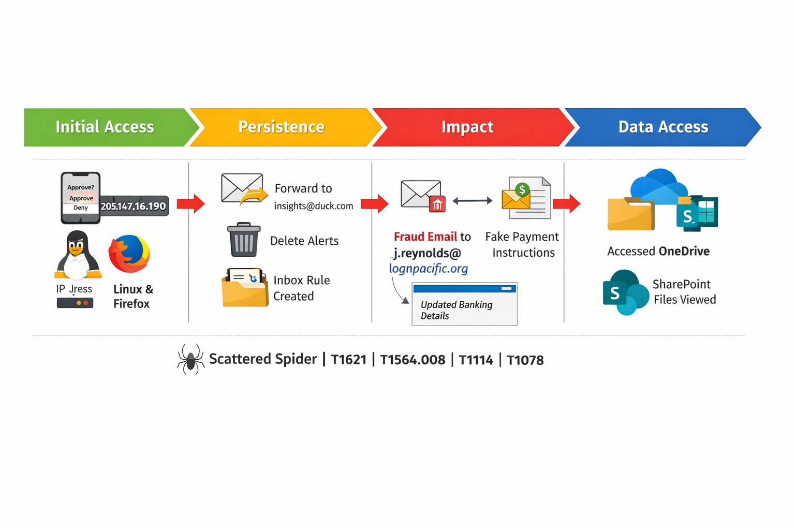

# THREAT HUNT - SCATTERED-INVOICE
BEC is the most common attack vector in the real world.
# 🛡️ BEC Investigation – Scattered Spider (MFA Fatigue Attack)

### Figure 1 – BEC Attack Kill Chain
MFA fatigue → Inbox rule persistence → Internal fraud → Data access

## 📌 Overview
This project documents a full-scale Business Email Compromise (BEC) investigation conducted using Microsoft Sentinel logs.

The attack leveraged MFA fatigue, inbox rule persistence, and internal email fraud to target financial operations.

---

## 🔍 Key Findings

- Compromised User: m.smith@lognpacific.org
- Attacker IP: 205.147.16.190
- Technique: MFA Fatigue (T1621)
- Persistence: Inbox Rules (T1564.008)
- Impact: Fraudulent email sent internally
- Data Access: OneDrive & SharePoint

---

## ⚔️ Attack Flow

1. MFA fatigue prompts sent to user
2. User approved authentication
3. Attacker accessed Outlook Web
4. Inbox rules created (forward + delete)
5. Fraud email sent to finance
6. Files accessed via OneDrive

---

## 🧠 MITRE ATT&CK Mapping

| Stage | Technique |
|------|----------|
| Initial Access | T1621 |
| Persistence | T1564.008 |
| Credential Use | T1078 |
| Collection | T1114 |

---

## 🚨 Detection & Response

- SigninLogs → MFA fatigue detection  
- CloudAppEvents → Inbox rule creation  
- EmailEvents → Fraud confirmation  

---

## 🔐 Containment Actions

- Revoke active sessions  
- Reset credentials  
- Remove inbox rules  
- Block attacker IP  

---

## 📂 Project Structure

See `/queries`, `/docs`, and `/images` for full investigation artifacts.
