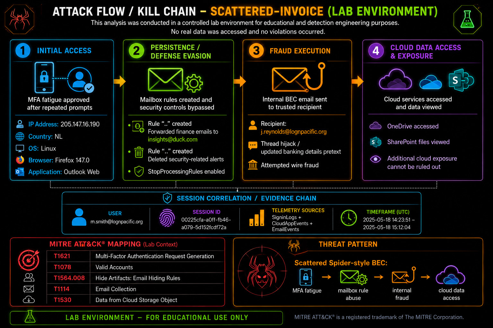

# 🚨 Cloud Identity Threat Detection - BEC Investigation
MFA Bypass & Behavioral Correlation (Scattered Spider–Inspired)

---

## BEC Attack Kill Chain

  

---

## 📢Executive Summary

This threat hunt investigated a Business Email Compromise (BEC) incident in which a finance employee's account was abused to support a fraudulent wire transfer attempt valued at GBP 24,500. Analysis of authentication, email, and cloud application telemetry confirmed that the attacker gained access through a successful `MFA fatigue attack` against the compromised user account, `m.smith@lognpacific.org`.  After repeated push notifications were denied, the user approved one request, enabling the attacker to establish an authenticated session from an anomalous external IP address.

Post-authentication activity showed a clear progression from access to persistence and fraud enablement. The attacker first accessed the victim's mailbox, then created malicious inbox rules designed to both forward financially relevant emails to attacker-controlled infrastructure and delete messages likely to expose the compromise, including security-related alerts. The activity was consistent with deliberate inbox-rule abuse for persistence, defense evasion, and intelligence gathering ahead of BEC execution.

The investigation also confirmed that the compromised session was used to send a fraudulent internal email as part of a thread-hijacking workflow targeting finance operations. Correlation across `SigninLogs`, `CloudAppEvents`, and `EmailEvents` linked the sign-in activity, inbox rule creation, and BEC email transmission to the same attacker session, providing high-confidence attribution of the attack chain. Additional evidence indicated access to Microsoft cloud resources beyond email, expanding the potential impact beyond the attempted payment fraud alone.

Several key indicators of compromise were identified during the hunt, including the attacker IP address, suspicious forwarding destination, anomalous Linux/Firefox user agent profile, and a shared Azure AD session identifier connecting the full sequence of malicious activity. These artifacts, combined with the observed behavior, align closely with Scattered Spider-style tradecraft, particularly the use of MFA fatigue, cloud identity abuse, inbox rule manipulation, and financially motivated targeting of internal business processes.

From a defensive perspective, the incident exposed weaknesses in identity protection, user resilience to MFA fatigue, and detection coverage for suspicious inbox-rule creation and anomalous cloud access. In response, this hunt produced actionable detection opportunities for Microsoft Sentinel, including MFA fatigue correlation, inbox-rule persistence monitoring, external forwarding detection, and multi-stage session-based correlation. Immediate containment priorities include revoking active sessions, removing malicious inbox rules, resetting credentials, and reviewing downstream access to email and cloud-stored data.

Overall, this hunt demonstrates how a relatively low-complexity user action - approving an MFA prompt - can enable a full BEC attack path when combined with valid credentials, cloud-native persistence, and trusted internal communication channels. The findings reinforce the need for stronger conditional access controls, improved alerting on post-authentication abuse, and rapid automated response workflows to contain identity-driven attacks before financial impact occurs.

---

## 🚨 Incident Overview

A suspected Business Email Compromise (BEC) incident triggered this threat hunt after a GBP 24,500 wire transfer was redirected using fraudulent banking details. The transaction was stopped by the bank before completion, but the attempted fraud indicated that a trusted internal account had likely been compromised and used to influence finance operations.
Initial reporting identified `Mark Smith`, a finance employee, as the apparent sender of the message containing the updated payment instructions. Mark later reported receiving repeated `multi-factor authentication (MFA` prompts the previous evening and stated that he eventually approved one request to stop the notifications. The following morning, his team discovered inbox rules that he did not recognize or create, raising immediate concern that his Microsoft 365 account had been accessed and manipulated by an unauthorized party.

The purpose of this hunt was to determine how the attacker obtained access, what actions were taken after authentication, what persistence and evasion mechanisms were established, whether fraudulent communications were sent, and whether additional cloud resources were accessed during the compromise window. The investigation focused on identifying the compromised identity, attacker infrastructure, mailbox manipulation, evidence of fraud execution, and indicators that could support containment, detection engineering, and future response automation.

Analysis was conducted in Microsoft Sentinel using the `SigninLogs`, `CloudAppEvents`, and `EmailEvents` tables across the defined investigation window. The hunt centered on correlating identity, email, and cloud application telemetry to reconstruct the full attack path from initial access through post-compromise activity. Particular attention was given to `MFA fatigue` patterns, anomalous sign-in geography, suspicious device and browser characteristics, malicious inbox rule creation, internal thread hijacking, and access to Microsoft cloud applications such as Outlook, OneDrive, and SharePoint.

The broader objective of the hunt was not only to confirm the compromise, but also to translate the findings into practical defensive outcomes. This included extracting indicators of compromise, identifying control gaps, mapping activity to MITRE ATT&CK, and developing high-confidence detection and response opportunities in Microsoft Sentinel. The scenario reflects a realistic cloud identity-driven BEC attack in which valid credentials, user-approved MFA, and trusted internal communications were leveraged to facilitate financial fraud and conceal malicious activity.

---

## 🔧 Environment and Data Sources
The investigation was conducted within Microsoft Sentinel in the LAW-Cyber-Range workspace, which served as the central analysis environment for reviewing authentication, email, and cloud activity associated with the suspected Business Email Compromise (BEC). The defined investigation window focused on activity occurring between 25 February 2026, 21:00 UTC and 26 February 2026, 00:00 UTC, aligning with the period in which the reported MFA prompts, unauthorized access, inbox rule creation, and fraudulent email activity took place.

The hunt relied on three primary telemetry sources to reconstruct the attack chain and validate the sequence of malicious activity:
- **SigninLogs**
This table was used to investigate identity and authentication behavior. It provided visibility into the compromised user's sign-in attempts, MFA challenge outcomes, successful authentication events, source IP addresses, geographic anomalies, application access, device characteristics, browser information, session identifiers, and conditional access outcomes. These records were essential for confirming the account compromise and identifying the attacker's access path.
	
- **CloudAppEvents**
This table was used to analyze post-authentication cloud activity within Microsoft 365 services. It provided evidence of mailbox access, inbox rule creation, persistence mechanisms, and access to additional cloud-hosted resources. The RawEventData field also enabled deeper inspection of rule parameters and session context, including forwarding destinations, trigger keywords, and correlation artifacts such as the Azure AD session ID linking multiple attacker actions.
	
- **EmailEvents**
	This table was used to validate the Business Email Compromise component of the incident. It provided visibility into fraudulent email transmission from the compromised account, recipient targeting, subject line context, email direction, and sender IP correlation. This telemetry was critical in demonstrating that the authenticated session was used not only for persistence and reconnaissance, but also for direct fraud enablement.
	
Together, these data sources enabled a cross-table investigative approach, allowing authentication events, cloud application actions, and malicious email activity to be correlated into a single attack narrative. This multi-source visibility was necessary to establish high-confidence findings, confirm attacker behavior across the full compromise lifecycle, and support the development of actionable detections, response playbooks, and indicators of compromise.

---

## 🎯 Key Outcomes

- Identified MFA fatigue attack leading to account compromise
- Correlated attacker activity across identity, email, and cloud telemetry
- Detected malicious inbox rules used for persistence and evasion
- Confirmed fraudulent internal email targeting finance operations
- Identified post-compromise data access in Microsoft OneDrive

---

## 🎨 Indicators of Compromise (IOCs)

The investigation identified multiple indicators of compromise across authentication, mailbox activity, and post-authentication cloud access. These artifacts provide high-confidence evidence of unauthorized access and can be used to support detection engineering, incident scoping, threat correlation, and containment activities. In this case, the IOCs are especially valuable because they connect the initial MFA fatigue compromise to the persistence mechanisms, fraudulent email activity, and broader cloud resource access observed during the investigation.

- **Network Indicators**
The primary attacker infrastructure identified during the hunt was the source IP address 205.147.16.190. This address was associated with the suspicious successful sign-in to the compromised account and was later correlated with fraudulent email activity, making it one of the strongest network-level indicators in the case. Its geolocation to the Netherlands (NL) further reinforced the anomaly when compared with the expected context of the legitimate user's activity.

- **Identity and Session Indicators**
The compromised account was m.smith@lognpacific.org, which served as the central identity abused throughout the incident. Once access was obtained, activity across authentication logs, cloud application telemetry, and email records was linked through the Azure AD session identifier 00225cfa-a0ff-fb46-a079-5d152fcdf72a. This session ID was a critical correlation artifact because it connected the successful sign-in, inbox rule creation, mailbox access, and related cloud activity to the same authenticated attacker session.

- **Device and User-Agent Indicators**
The malicious session was associated with an anomalous device profile that differed from the user's expected corporate baseline. The attacker activity was logged from Linux using Firefox 147.0, a combination that stood out against the normal Windows-based enterprise device context. These attributes are valuable supporting indicators because they add device and browser-level anomalies to the IP and identity evidence already established.

- **Mailbox Persistence Indicators**
The attacker created two malicious inbox rules to maintain visibility into sensitive communications and suppress signs of compromise. The first rule, named ".", was configured to forward finance-related messages externally, while the second rule, named "..", was designed to delete security-related notifications. These rule names are themselves indicators of suspicious activity because they were intentionally minimal and visually inconspicuous.
A particularly important mailbox IOC was the forwarding destination insights@duck.com, which represented attacker-controlled infrastructure used to receive selected email content from the compromised mailbox. Additional configuration artifacts included the use of the StopProcessingRules parameter, which ensured that once the malicious forwarding rule was triggered, subsequent inbox rules would not execute.

- **Keyword-Based Rule Indicators**
The rule logic also exposed content-based indicators that reflected attacker intent. The forwarding rule targeted finance-related keywords associated with invoice and payment discussions, confirming that the objective was selective interception of business-relevant communications. The deletion rule targeted the keywords suspicious, security, phishing, unusual, compromised, verify, indicating deliberate suppression of warning messages, security notifications, and other emails likely to alert the user or defenders.

- **Email Fraud Indicators**
The compromised session was used to send a fraudulent internal email as part of the BEC workflow. The message was classified as Intra-org, showing that the attacker operated within the trusted internal email environment rather than relying on external spoofing infrastructure. The sender IP observed in the email telemetry matched 205.147.16.190, directly linking the malicious sign-in session to the attempted fraud.

- **Cloud Access Indicators**
Beyond mailbox abuse, the attacker also accessed Microsoft cloud services associated with OneDrive and SharePoint. These application access artifacts are important because they indicate that the incident extended beyond email compromise alone and introduced the possibility of document access, internal reconnaissance, or broader data exposure. As a result, the IOC set for this case should not be limited to email artifacts, but should also include the cloud applications touched during the malicious session.

- **Operational Value of the IOC Set**
Taken together, these indicators form a coherent and actionable IOC set that can support both immediate response and long-term detection improvement. The IP address, compromised user identity, session ID, forwarding destination, suspicious rule names, rule keywords, browser profile, and cloud applications accessed all contribute to a high-confidence picture of attacker behavior. These artifacts can be used to search for related activity elsewhere in the environment, tune Microsoft Sentinel detections, enrich case documentation, and guide containment actions such as session revocation, inbox rule removal, and retrospective review of similar mailbox activity across other accounts.

| IOC Type | Value | Context |
|---|---|---|
| IP Address | `205.147.16.190` | Attacker source IP (Netherlands) |
| Email Address | `insights@duck.com` | Inbox rule forwarding destination |
| Email Address | `jwilson.vhr@proton.me` | *(not observed in this hunt, included from threat intel on Scattered Spider)* |
| Session ID | `00225cfa-a0ff-fb46-a079-5d152fcdf72a` | Attacker session GUID across all activity |
| User Agent | `Firefox 147.0 / Linux` | Attacker browser and OS |
| Email Subject | `RE: Invoice #INV-2026-0892 - Updated Banking Details` | BEC email subject line |
| Inbox Rule | `.` (single dot) | Forward rule name |
| Inbox Rule | `..` (double dot) | Delete rule name |

---
  
## Attack Timeline

| Time (UTC) | Event |
|---|---|
| 21:54:24 | First MFA fatigue attempt (ResultType 50074) |
| 21:54:55 | Second MFA denial (ResultType 50140) |
| 21:55:15 | Third MFA denial (ResultType 50140) |
| 21:59:52 | MFA approved, attacker signs in to One Outlook Web |
| ~22:00 | MailItemsAccessed, attacker reads Mark's emails |
| 22:02 | Forward rule (`.`) created, sends invoice emails to insights@duck.com |
| 22:03 | Delete rule (`..`) created, auto-deletes security alerts |
| ~22:09 | Attacker accesses SharePoint and OneDrive files |
| ~22:24 | BEC email sent to j.reynolds with fraudulent invoice |

---

## 🔎 Detection & Analysis

### Key Artifacts

- **KQL Queries**  
  [`queries.md`](./queries/queries.md)  
  Used during the investigation to identify attacker behavior, later refined into production detection rules.

- **Detection Engineering**  
  [`sentinel-analytics.md`](./detection-rules/sentinel-analytics.md)  
  Primary detection rules developed for Microsoft Sentinel analytics.

- **Automation / SOAR**  
  [`playbooks.md`](./automation/playbooks.md)  
  SOAR playbooks designed to automate security operations and enable faster, more consistent incident response.

---

## 📊 Detection Flow

1. **User Authentication**  
   Successful login using valid credentials  

2. **Authentication Control Failure**  
   MFA expected but not enforced  

3. **Identity Manipulation**  
   MFA method reset or modification detected  

4. **Post-Authentication Expansion**  
   Access to multiple applications and IP addresses  

5. **Anomalous Activity**  
   Geographic inconsistency (impossible travel)  

6. **Detection Trigger**  
   Risk score threshold exceeded (Score ≥ 6)  

7. **Automated Response**  
   SOAR playbook executed (account containment and session revocation)

## 📊 Detection Flow Diagram

## Solution Summary

| # | Question | Answer |
|---|----------|------|
| Q00 | Workspace name | `law-cyber-range` |
| Q01 | Compromised account | `m.smith@lognpacific.org` |
| Q02 | Attacker source IP | `205.147.16.190` |
| Q03 | Attack origin country | `NL` |
| Q04 | MFA denial error code | `50074` |
| Q05 | MFA fatigue intensity | `3` |
| Q06 | Application accessed | `One Outlook Web` |
| Q07 | Attacker OS | `Linux` |
| Q08 | Attacker browser | `Firefox 147.0` |
| Q09 | First post-auth action | `MailItemsAccessed` |
| Q10 | Rule creation method | `New-InboxRule` |
| Q11 | Forward rule name | `.` |
| Q12 | Forward destination | `insights@duck.com` |
| Q13 | Forward keywords | `invoice, payment, wire, transfer` |
| Q14 | Rule processing flag | `StopProcessingRules` |
| Q15 | Delete rule name | `..` |
| Q16 | Delete keywords | `suspicious, security, phishing, unusual, compromised, verify` |
| Q17 | BEC target | `j.reynolds@lognpacific.org` |
| Q18 | BEC subject line | `RE: Invoice #INV-2026-0892 - Updated Banking Details` |
| Q19 | Email direction | `Intra-org` |
| Q20 | BEC sender IP | `205.147.16.190` |
| Q21 | Cloud app accessed | `Microsoft OneDrive for Business` |
| Q22 | SharePoint app accessed | `Microsoft SharePoint Online` |
| Q23 | Session correlation | `00225cfa-a0ff-fb46-a079-5d152fcdf72a` |
| Q24 | Conditional Access status | `notApplied` |
| Q25 | MFA fatigue MITRE ID | `T1621` |
| Q26 | Email rules MITRE ID | `T1564.008` |
| Q27 | Credential source | `infostealer` |
| Q28 | Immediate containment | `revoke sessions` |
| Q29 | Threat actor attribution | `Scattered Spider` |

---

## 🧠 MITRE ATT&CK Mapping

| Attack Phase         | Technique                             | ID        | Activity Observed                                                                 | Detection Gap                                                                     |
| -------------------- | ------------------------------------- | --------- | --------------------------------------------------------------------------------- | --------------------------------------------------------------------------------- |
| Initial Access       | Valid Accounts: Cloud Accounts        | T1078.004 | Compromised credentials were used to successfully authenticate to the environment | No detection for anomalous sign-ins based on location, device, or risk signals    |
| Initial Access       | MFA Request Generation                | T1621     | Multiple MFA push notifications were sent prior to user approval                  | No detection for repeated MFA denials followed by a successful authentication     |
| Persistence          | Email Forwarding Rule                 | T1114.003 | Malicious inbox rule created to forward invoice-related emails externally         | No alerting on inbox rules configured with external forwarding destinations       |
| Defense Evasion      | Email Hiding Rules                    | T1564.008 | Inbox rule created to automatically delete security-related emails                | No detection for rules that suppress or delete security or alert-related emails   |
| Collection           | Email Collection: Remote Email Access | T1114.002 | Mailbox accessed remotely from attacker-controlled IP during active session       | No alerting on mailbox access from unfamiliar or anomalous IP addresses           |
| Lateral Movement     | Internal Spearphishing                | T1534     | Fraudulent email sent internally to finance personnel from compromised account    | Internal email traffic bypassed traditional email security controls               |
| Collection           | Data from Cloud Storage               | T1530     | Files accessed from OneDrive and SharePoint following account compromise          | No detection for suspicious file access tied to anomalous session activity        |
| Resource Development | Obtain Credentials: Purchase          | T1589.001 | Credentials likely sourced from external infostealer marketplace                  | Limited visibility into credential exposure; no monitoring for leaked credentials |

These findings highlight multiple gaps across identity, email, and cloud telemetry, emphasizing the need for improved detection coverage and correlation across attack stages.

---

All detections are:

- Production-ready
- MITRE ATT&CK aligned
- Designed for Microsoft Sentinel
  
---

Automation & Response

SOAR playbooks were developed to:

- Revoke user sessions
- Remove malicious inbox rules
- Purge fraudulent emails
- Notify SOC and affected users
- Augment incidents with correlated telemetry to improve contextual analysis.

---

Project Structure

- /queries  KQL queries used during investigation
- /detection-rules  Microsoft Sentinel analytics rules
- sentinel-analytics.md  Primary detection reference SOAR playbooks and response workflows

---

Skills Demonstrated

- Security Incident Investigation (SOC)
- Microsoft Sentinel & KQL
- Threat Detection Engineering
- MITRE ATT&CK Mapping
- Identity-Based Attack Analysis
- SOAR Automation (Logic Apps)

---

Key Insight

This investigation highlights how modern attackers:

- Exploit user behavior (MFA fatigue)
- Establish persistence through inbox rules
- Operate entirely within trusted cloud services
- Execute fraud without malware

Effective detection requires correlating identity, email, and cloud activity, not relying on a single data source.

